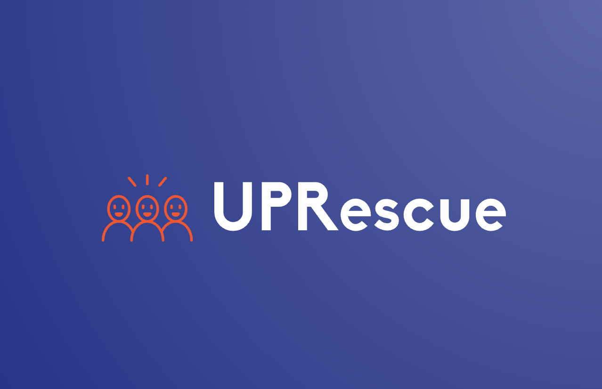

<!-- Improved compatibility of back to top link: See: https://github.com/othneildrew/Best-README-Template/pull/73 -->
<a name="readme-top"></a>
<!--
*** Thanks for checking out the Best-README-Template. If you have a suggestion
*** that would make this better, please fork the repo and create a pull request
*** or simply open an issue with the tag "enhancement".
*** Don't forget to give the project a star!
*** Thanks again! Now go create something AMAZING! :D
-->


<!-- PROJECT SHIELDS -->
<!--
*** I'm using markdown "reference style" links for readability.
*** Reference links are enclosed in brackets [ ] instead of parentheses ( ).
*** See the bottom of this document for the declaration of the reference variables
*** for contributors-url, forks-url, etc. This is an optional, concise syntax you may use.
*** https://www.markdownguide.org/basic-syntax/#reference-style-links
-->
[![Contributors][contributors-shield]][contributors-url]
[![Forks][forks-shield]][forks-url]
[![Stargazers][stars-shield]][stars-url]
[![Issues][issues-shield]][issues-url]
[![MIT License][license-shield]][license-url]
[![LinkedIn][linkedin-shield]][linkedin-url]


<!-- PROJECT LOGO -->
<br />
<div align="center">
  <a href="https://github.com/upcs/cs341-spring-2024-data-morning">
    
  </a>

<h3 align="center">UP Rescue</h3>

  <p align="center">
    Welcome to UP Rescue
    <br />
    UP Rescue is a project started by students at the University of Portland to help those in need in the Greater Portland area to gain access and knowledge to resources like shelters and food banks
    <br />
    <a href="https://github.com/upcs/cs341-spring-2024-data-morning"><strong>Explore the docs »</strong></a>
    <br />
    <br />
    <a href="https://github.com/upcs/cs341-spring-2024-data-morning">View Demo</a>
    ·
    <a href="https://github.com/upcs/cs341-spring-2024-data-morning/issues/new?labels=bug&template=bug-report---.md">Report Bug</a>
    ·
    <a href="https://github.com/upcs/cs341-spring-2024-data-morning/issues/new?labels=enhancement&template=feature-request---.md">Request Feature</a>
  </p>
</div>


<!-- TABLE OF CONTENTS -->
<details>
  <summary>Table of Contents</summary>
  <ol>
    <li>
      <a href="#about-the-project">About The Project</a>
      <ul>
        <li><a href="#built-with">Built With</a></li>
      </ul>
    </li>
    <li>
      <a href="#getting-started">Getting Started</a>
      <ul>
        <li><a href="#prerequisites">Prerequisites</a></li>
        <li><a href="#installation">Installation</a></li>
      </ul>
    </li>
    <li><a href="#usage">Usage</a></li>
    <li><a href="#roadmap">Roadmap</a></li>
    <li><a href="#contributing">Known Bugs</a></li>
    <li><a href="#license">License</a></li>
    <li><a href="#contact">Contact</a></li>
    <li><a href="#acknowledgments">Acknowledgments</a></li>
  </ol>
</details>


<!-- ABOUT THE PROJECT -->
## About The Project

[![Product Name Screen Shot][product-screenshot]](https://example.com)

Here's a blank template to get started: To avoid retyping too much info. Do a search and replace with your text editor for the following: `upcs`, `cs341-spring-2024-data-morning`, `twitter_handle`, `linkedin_username`, `email_client`, `email`, `project_title`, `project_description`

<p align="right">(<a href="#readme-top">back to top</a>)</p>


### Built With

* [![JavaScript][JS.com]][JS-url]
* [![GoogleMaps][GoogleMaps.com]][GoogleMaps-url]
* [![JQuery][JQuery.com]][JQuery-url]

<p align="right">(<a href="#readme-top">back to top</a>)</p>


<!-- GETTING STARTED -->
## Getting Started

To get started you will need to have these files installed:

### Prerequisites

To install npm on your local machine, type this into your terminal / command line
* npm - Run the code
  ```sh
  npm install npm@latest -g
  ```

* sqlite3 - Interact with the database
  ```sh
  npm install sqlite3
  ```

### Installation and Running


1. Clone the repo
   ```sh
   git clone https://github.com/upcs/cs341-spring-2024-data-morning.git
   ```
2. Install NPM packages
   ```sh
   npm install
   ```
3. Navigate to the Public folder
   ```js
   cd /UPRescue/Public/
   ```
4. To start type in terminal:
   ```sh
   npm start
   ```
5. Type in your local browser:
   ```sh
   localhost:3000
   ```

<p align="right">(<a href="#readme-top">back to top</a>)</p>


<!-- USAGE EXAMPLES -->
## Usage

Use this space to show useful examples of how a project can be used. Additional screenshots, code examples and demos work well in this space. You may also link to more resources.

_For more examples, please refer to the [Documentation](https://example.com)_

<p align="right">(<a href="#readme-top">back to top</a>)</p>


<!-- ROADMAP -->
## Roadmap

Here was the original roadmap from the 1st team:
- [X] Create Map
    - [X] Add Geolocation to get the user's current location
    - [X] Create markers for each location
    - [ ] Add Google Map API InfoWindows for each place
- [X] Create Database
    - [X] Add data found on internet and Multnomah County Website
    - [ ] 
- [ ] Login in Page to modify database
    - [ ] Nested Feature

See the [open issues](https://github.com/upcs/cs341-spring-2024-data-morning/issues) for a full list of proposed features (and known issues).

<p align="right">(<a href="#readme-top">back to top</a>)</p>


<!-- CONTRIBUTING -->
## Known Errors

1. NPM:
   Between Windows and Mac OS there was an issue in the npm sqlite3 files so we had to uninstall npm and reinstall:
   ```sh
   npm uninstall sqlite3
   npm install sqlite3
   ```
   

<p align="right">(<a href="#readme-top">back to top</a>)</p>


<!-- LICENSE -->
## License

Distributed under the MIT License. See `LICENSE.txt` for more information.

<p align="right">(<a href="#readme-top">back to top</a>)</p>


<!-- CONTACT -->
## Contact

Your Name - [@twitter_handle](https://twitter.com/twitter_handle) - email@email_client.com

Project Link: [https://github.com/upcs/cs341-spring-2024-data-morning](https://github.com/upcs/cs341-spring-2024-data-morning)

<p align="right">(<a href="#readme-top">back to top</a>)</p>


<!-- ACKNOWLEDGMENTS -->
## Acknowledgments

* []()
* []()
* []()

<p align="right">(<a href="#readme-top">back to top</a>)</p>


<!-- MARKDOWN LINKS & IMAGES -->
<!-- https://www.markdownguide.org/basic-syntax/#reference-style-links -->
[contributors-shield]: https://img.shields.io/github/contributors/upcs/cs341-spring-2024-data-morning.svg?style=for-the-badge
[contributors-url]: https://github.com/upcs/cs341-spring-2024-data-morning/graphs/contributors
[forks-shield]: https://img.shields.io/github/forks/upcs/cs341-spring-2024-data-morning.svg?style=for-the-badge
[forks-url]: https://github.com/upcs/cs341-spring-2024-data-morning/network/members
[stars-shield]: https://img.shields.io/github/stars/upcs/cs341-spring-2024-data-morning.svg?style=for-the-badge
[stars-url]: https://github.com/upcs/cs341-spring-2024-data-morning/stargazers
[issues-shield]: https://img.shields.io/github/issues/upcs/cs341-spring-2024-data-morning.svg?style=for-the-badge
[issues-url]: https://github.com/upcs/cs341-spring-2024-data-morning/issues
[license-shield]: https://img.shields.io/github/license/upcs/cs341-spring-2024-data-morning.svg?style=for-the-badge
[license-url]: https://github.com/upcs/cs341-spring-2024-data-morning/blob/master/LICENSE.txt
[linkedin-shield]: https://img.shields.io/badge/-LinkedIn-black.svg?style=for-the-badge&logo=linkedin&colorB=555
[linkedin-url]: https://linkedin.com/in/linkedin_username
[product-screenshot]: images/screenshot.png
[JS.com]: https://img.shields.io/badge/javascript-F7DF1E?logo=javascript&logoColor=f5f5f5
[JS-url]: https://developer.mozilla.org/en-US/docs/Web/JavaScript
[GoogleMaps.com]: https://img.shields.io/badge/googlemaps-4285F4?logo=googlemaps&logoColor=white
[GoogleMaps-url]: https://developers.google.com/maps/documentation/javascript/overview
[JQuery.com]: https://img.shields.io/badge/jQuery-0769AD?style=for-the-badge&logo=jquery&logoColor=white
[JQuery-url]: https://jquery.com 
